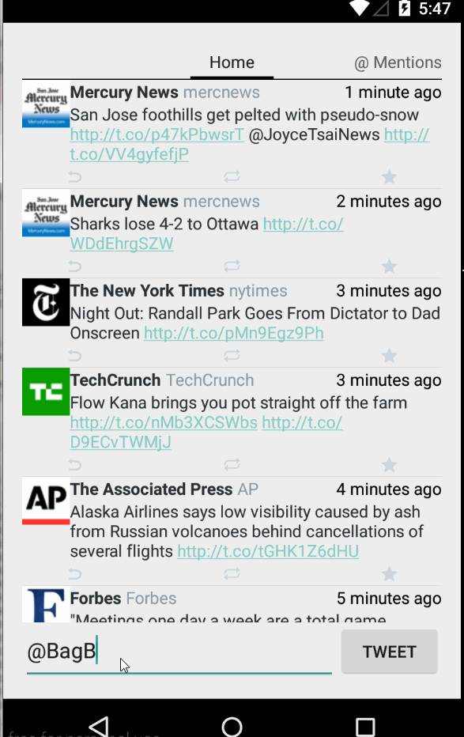

Homework 4 for CodePath Android - A Simple Twitter Client

Time spent: 9 hours

Required from week 3:

 * [X] All of week 3's required stories.
 * [X] User can view their home timeline tweets.
 * [X] User can view the recent mentions of their username.
 * [X] User can navigate to view their own profile.
 * [X] User can see picture, tagline, # of followers, # of following, and tweets on their profile.
 * [X] User can click on the profile image in any tweet to see another user's profile.
 * [X] User can see picture, tagline, # of followers, # of following, and tweets of clicked user.
 * [X] Profile view should include that user's timeline
 * [X] User can infinitely paginate any of these timelines (home, mentions, user) by scrolling to the bottom.

 